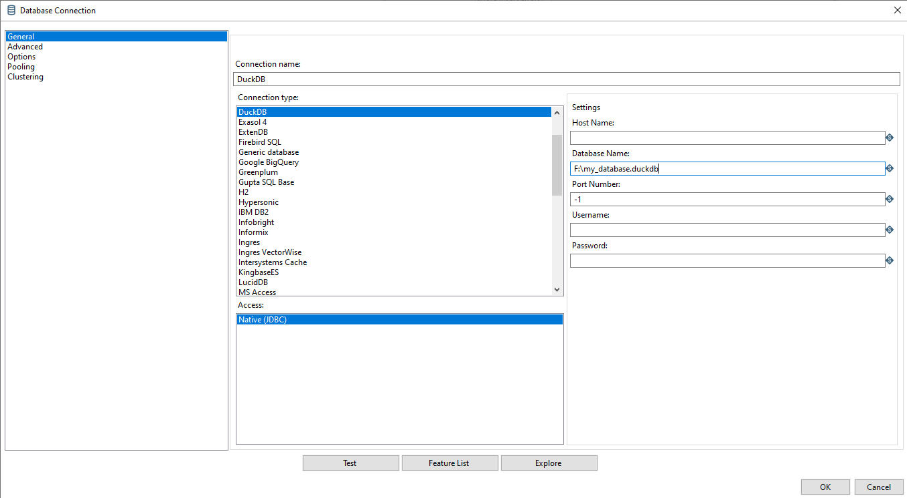

# duckdb-kettle-plugin
A Kettle plugin for supporting DuckDB table input/output.

## Build and Install Instructions

### Prerequisites
The following should already be installed and configured on your local machine:
* Maven, version 3+
* Java JDK 11
* This [settings.xml](https://raw.githubusercontent.com/pentaho/maven-parent-poms/master/maven-support-files/settings.xml) in your <user-home>/.m2 directory

### Clone and Build the Plugin (jar file)
Begin by cloning this repository locally.
```
git clone https://github.com/forgineer/duckdb-kettle-plugin.git
```

After cloning, review the `pom.xml` file for the project `<version>` tag and ensure it is the same version as the Pentaho Data Integration (Kettle) version you are using.
```xml
...
<groupId>com.forgineer</groupId>
<artifactId>duckdb-kettle-plugin</artifactId>
<!-- The version should reflect the PDI (Kettle version) -->
<!-- Ex: 9.4.0.0-343, 9.3.0.0-428, etc. -->
<version>9.4.0.0-343</version>
...
```

Also, review the DuckDB version and update it to the desired version.
```xml
...
<dependency>
    <groupId>org.duckdb</groupId>
    <artifactId>duckdb_jdbc</artifactId>
    <!-- The version should reflect JDBC driver used and vice versa -->
    <version>0.9.2</version>
</dependency>
...
```

Lastly, update the JDBC driver jar file name (version) to match the version in the `pom.xml` file. This file can be verified by downloading from Maven or directly from DuckDB.
```java
@Override
public String[] getUsedLibraries() {
    // Download the JDBC driver (jar) from Maven or DuckDB
    // The version should match POM
    return new String[] {"duckdb_jdbc-0.9.2.jar"};
}
```

After reviewing and/or updating the above, proceed with packaging the jar file.
```
mvn package 
```

This will create a jar and zip file inside of the `target` directory:
* duckdb-kettle-plugin-x.x.x.x-xxx.jar
* duckdb-kettle-plugin-x.x.x.x-xxx.zip

Unpack the zip file into the plugins directory (`\data-integration\plugins`) of your local Kettle install. The zip file should include the plugin and necessary JDBC driver for DuckDB.
```
data-integration\
    plugins\
        duckdb-kettle-plugin-x.x.x.x-xxx\
            lib\
                duckdb_jdbc-x.x.x.jar
            duckdb-kettle-plugin-x.x.x.x-xxx.jar

```

Restart Kettle (Spoon).

### Configure DuckDB Connection
DuckDB should now be an available connection type from a table input or output step. Only the database name is required to create the DuckDB file.



> ✋ Use caution when using Kettle properties within your database name parameter. In recent testing, this has caused errors with the interpreted file path that Kettle generates.